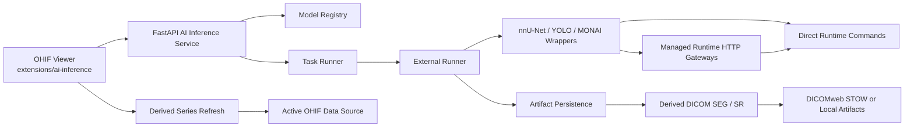

# OHIF AI Inference Architecture

## 1. Status and Deployment Readiness

The current workspace already contains a working integration slice for nnU-Net, YOLO, and MONAI across both OHIF and the backend service.

What is already in place:

- OHIF front-end extension package at `extensions/ai-inference`
- AI panel and toolbar entry wired into active modes
- FastAPI backend at `backend/ai-inference-service`
- Per-family isolation for nnU-Net, YOLO, and MONAI
- Managed runtime startup and shutdown for local deployment
- JSON-driven Windows production startup flow
- DICOM SEG/SR generation and optional DICOMweb refresh/STOW path

What this means operationally:

- The codebase is deployable as an integration platform.
- It is not a complete out-of-the-box model appliance by itself.
- Real deployment still requires three things to be supplied by the deployment environment:
  - matching runtime images or raw runtime commands for nnU-Net, YOLO, and MONAI
  - actual model files under the configured model directories
  - reachable DICOMweb endpoints if real source retrieval or STOW is required

So the honest status is: the OHIF integration and backend orchestration are complete enough to land in an environment, but the final production readiness depends on providing real family runtimes and models that match the repository's command contract.

## 2. High-Level Architecture

The system is built around one core rule: the viewer and API know about a common normalized inference contract, while model-family-specific execution stays isolated behind family runners and runtime commands.

## 3. Front-End Integration

### 3.1 Extension Entry

Primary front-end entry:

- `extensions/ai-inference/src/index.tsx`

The extension registers four main surfaces:

- commands module
- customization module
- panel module
- toolbar module

This keeps the AI integration aligned with standard OHIF extension patterns rather than modifying platform internals.

### 3.2 User-Facing Surfaces

Main UI pieces:

- AI panel for backend URL, model selection, task selection, and run controls
- toolbar entry for current modes
- viewport rendering helpers for segmentation and detection overlays

The panel is the operational control surface. It reads backend health, lists models, submits inference, polls jobs when async is enabled, and triggers viewport refresh after results are available.

### 3.3 Front-End Command Flow

Primary behavior is implemented in:

- `extensions/ai-inference/src/getCommandsModule.ts`

Key command responsibilities:

- `checkBackendHealth`: verify backend connectivity
- `loadModels`: load model metadata from `/models`
- `runInference`: submit inference request to the backend
- `refreshJob`: refresh queued or running jobs and pull completed result
- `refreshDerivedSeries`: ask the active OHIF data source to refresh metadata for the derived series
- `applyLastResultToViewport`: render overlay/annotation output into the active viewport

The important design choice here is that front-end rendering is split into two layers:

- immediate visualization of the normalized result payload
- separate derived-series refresh so OHIF can ingest DICOM SEG/SR generated by the backend

That separation keeps the UI responsive while preserving a DICOM-native persistence path.

## 4. Backend Service Architecture

### 4.1 Service Entry

Backend root:

- `backend/ai-inference-service/app/main.py`

The backend is a FastAPI service that exposes model listing, health, inference submission, job status, and result retrieval. It also owns lifecycle startup for managed runtimes.

### 4.2 Core Backend Components

Important components:

- `app/core/settings.py`: environment-backed settings singleton
- `app/services/model_registry.py`: model family registration and `/models` payload
- `app/services/task_runner.py`: queued execution and job status transitions
- `app/services/external_runner.py`: out-of-process inference execution and normalized result loading
- `app/services/artifact_persistence.py`: staging generated DICOM artifacts and optional STOW
- `app/services/derived_dicom.py`: DICOM SEG/SR generation
- `app/services/managed_runtime_manager.py`: family runtime startup/shutdown
- `app/runtime_server.py`: managed runtime HTTP gateway for a single model family

### 4.3 Why Execution Is Out-of-Process

The backend intentionally avoids loading nnU-Net, YOLO, and MONAI directly into one Python process. Instead, each family executes outside the API process.

Benefits:

- dependency isolation between frameworks
- easier GPU scheduling and container mapping
- no cross-family import collisions
- cleaner failure boundaries
- simpler migration from local commands to containerized runtimes

That is the main architectural reason the integration remains maintainable instead of becoming one monolithic Python runtime.

## 5. Model Family Isolation

Each family has its own service and runner configuration:

- `app/services/nnunet_service.py`
- `app/services/yolo_service.py`
- `app/services/monai_service.py`

Each service contributes an `ExternalRunnerConfig` that defines:

- family name
- command environment variable
- wrapper command environment variable
- managed runtime command environment variable
- optional recommended wrapper command

The backend therefore treats all three families uniformly at the API layer, while allowing family-specific execution details underneath.

## 6. Runner Decision Model

Primary logic lives in:

- `backend/ai-inference-service/app/services/external_runner.py`

The execution strategy is:

1. Read the family-specific direct command environment variable.
2. If a direct command is present, execute it.
3. If no direct command is present but managed runtime mode is actually configured, fall back to the recommended wrapper path.
4. The wrapper can call the managed runtime HTTP gateway for the family.
5. The managed runtime gateway executes the final raw model command.

This gives the system three practical deployment modes without changing the API or front-end contract:

- direct family command mode
- wrapper plus raw command mode
- managed runtime gateway plus container mode

## 7. Managed Runtime Pattern

Managed runtime orchestration is implemented in:

- `backend/ai-inference-service/app/services/managed_runtime_manager.py`
- `backend/ai-inference-service/app/runtime_server.py`

Purpose of managed runtimes:

- start one lightweight HTTP gateway per family
- expose `/health` and `/infer`
- isolate family runtime startup from the main API process
- standardize fallback behavior for wrappers

On Windows, the default startup path uses:

- `backend/ai-inference-service/scripts/start-managed-nnunet.ps1`
- `backend/ai-inference-service/scripts/start-managed-yolo.ps1`
- `backend/ai-inference-service/scripts/start-managed-monai.ps1`

These family scripts delegate to the generic startup flow and materialize runtime commands from deployment configuration.

## 8. Derived DICOM Flow

The backend does not stop at JSON inference output. It can persist clinically meaningful derived artifacts.

Main steps:

1. Runner returns normalized payload and optional raw DICOM files.
2. `artifact_persistence.py` decides what must be staged or generated.
3. `derived_dicom.py` generates:
   - DICOM SEG for segmentation outputs
   - DICOM SR for detections or classification-style summaries
4. Artifacts are saved locally under the configured artifacts directory.
5. If STOW is configured, artifacts can be pushed to a remote DICOMweb endpoint.
6. Derived series metadata is returned to the front end.
7. OHIF refreshes series metadata from the active data source.

This is the key reason the integration is more than a demo overlay layer: inference results can be represented as DICOM-native derived objects.

## 9. Production Startup and Deployment Model

Primary deployment entry:

- `backend/ai-inference-service/scripts/start-production.ps1`

Default configuration file:

- `backend/ai-inference-service/config/production-runtime.json`

The production startup script does the following:

- loads one JSON deployment config file
- resolves model directories, image names, container args, ports, and DICOMweb settings
- exports the `AI_INFERENCE_*` environment variables consumed by the backend and runtime scripts
- optionally pulls images
- optionally creates model directories
- starts the backend service, which in turn can start managed runtimes

### 9.1 Current Runtime Contract

The repository uses a consistent runtime contract for each family runtime image:

- a mounted adapter entrypoint under `/opt/ohif-runtime/<family>/infer.py`
- an internal command described by `internalCommand`
- request and response files passed through `/runtime/work`
- a model directory mounted into the container

Mounted adapter files live under:

- `backend/ai-inference-service/container-runtime/common.py`
- `backend/ai-inference-service/container-runtime/nnunet/infer.py`
- `backend/ai-inference-service/container-runtime/yolo/infer.py`
- `backend/ai-inference-service/container-runtime/monai/infer.py`

The adapter layer is important because it lets container images conform to one stable outer contract even if the real family entrypoint inside the image differs.

## 10. Configuration Model

Configuration comes from three layers, in this precedence order:

1. explicit PowerShell script parameters
2. process environment variables
3. values from `config/production-runtime.json`

This is deliberate. It lets you:

- keep a baseline deployment in versioned JSON
- override values per machine or pipeline through environment variables
- force one-off behavior through explicit startup parameters

## 11. Code Navigation Guide

When maintaining the system, use this path depending on the problem you are investigating.

If the issue is UI or workflow:

- start at `extensions/ai-inference/src/getCommandsModule.ts`
- then read panel/store/render helpers

If the issue is model readiness or configuration hints:

- start at `app/services/model_registry.py`
- then inspect the family service files

If the issue is command resolution or process execution:

- start at `app/services/external_runner.py`

If the issue is runtime startup or gateway behavior:

- start at `app/services/managed_runtime_manager.py`
- then inspect `app/runtime_server.py`

If the issue is DICOM outputs:

- start at `app/services/artifact_persistence.py`
- then inspect `app/services/derived_dicom.py` and `app/services/source_series.py`

If the issue is deployment wiring:

- start at `scripts/start-production.ps1`
- then inspect `scripts/runtime-command-common.ps1`
- then inspect `config/production-runtime.json`

## 12. Known Boundaries and Remaining Gaps

The platform is integrated, but some boundaries remain intentionally externalized.

Not shipped in this repo as finished production assets:

- final nnU-Net runtime image build recipe
- final YOLO runtime image build recipe
- final MONAI runtime image build recipe
- actual family-specific internal inference engines under `/opt/ohif-ai/...`
- model weights and deployment-specific GPU/container policies

Those are not architectural holes in the API or OHIF integration. They are deployment assets that must be provided by the environment that adopts this platform.

## 13. Maintenance Recommendations

Recommended maintenance rules:

- keep family-specific inference code out of the FastAPI process
- do not collapse nnU-Net, YOLO, and MONAI into one shared runtime implementation
- preserve the normalized response contract between runners and the API
- preserve DICOM-derived persistence instead of relying only on viewport overlays
- keep production configuration JSON-driven and environment-overridable
- add new model families by copying the existing family isolation pattern rather than branching inside shared runtime code

## 14. Summary

This integration is no longer just a viewer-side prototype. It is a layered AI inference platform for OHIF with:

- OHIF UI entry points
- isolated backend execution
- managed runtime orchestration
- DICOM-native derived artifact generation
- deployable production startup scripts

The main caveat is straightforward: deployment is real only when the target environment supplies real runtime images, model artifacts, and DICOM infrastructure matching the documented command contract.
